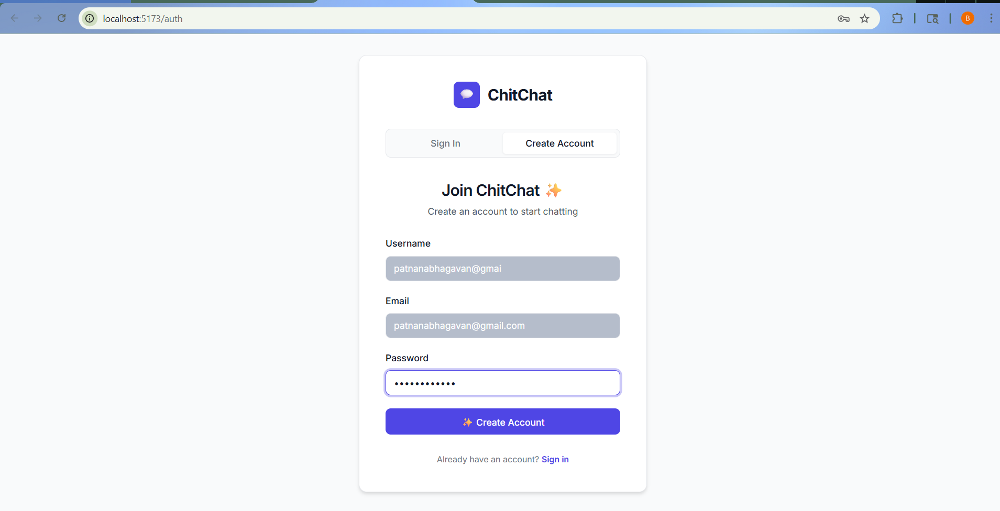
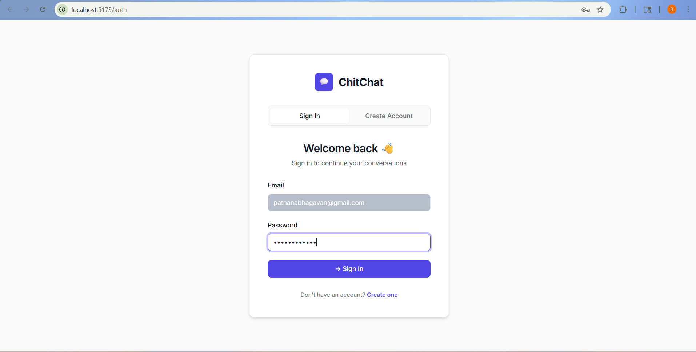
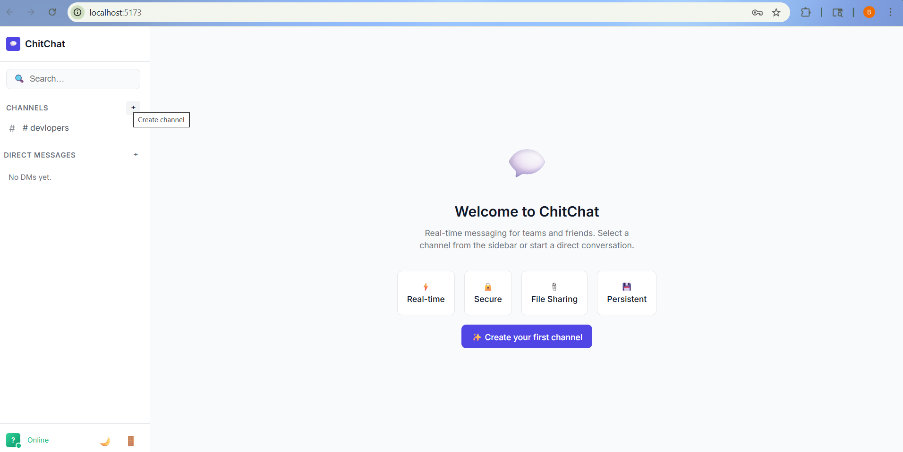
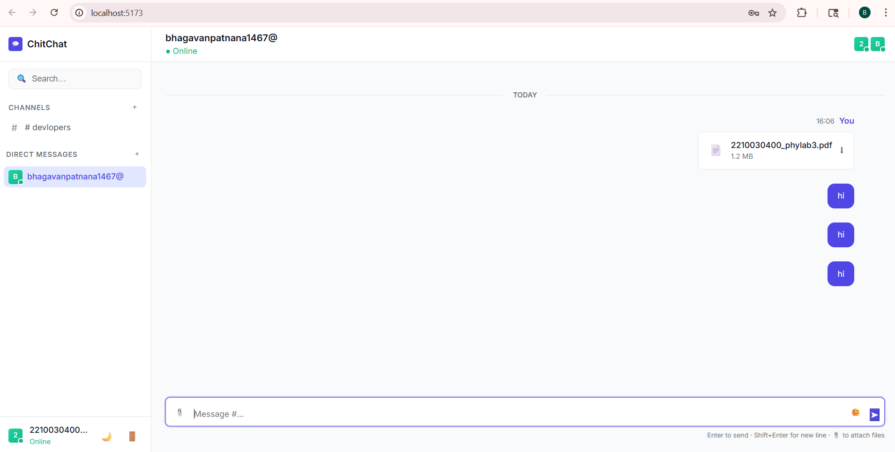
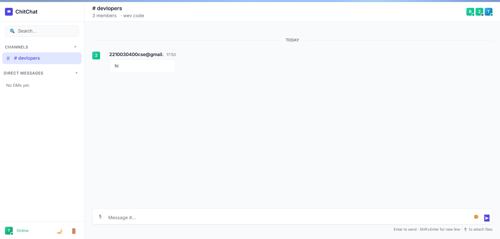
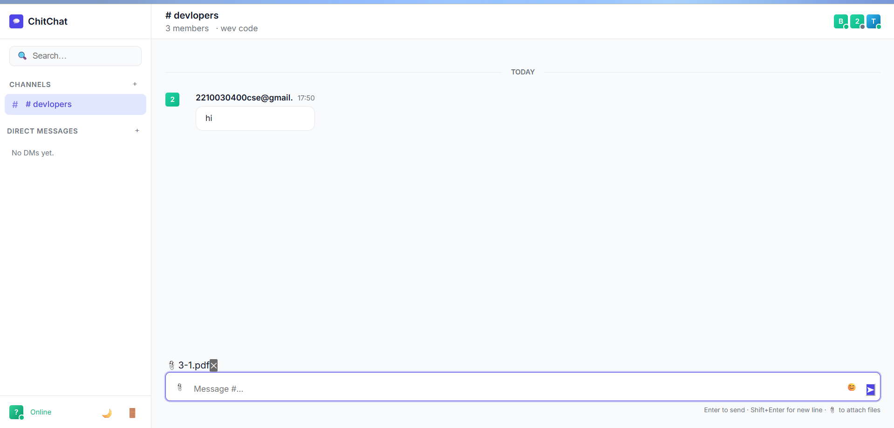

# ChitChat — Real-Time Chat Application

A full-stack real-time chat application built with the MERN stack and Socket.IO.
##  Environment Variables

Create a `.env` file in the server folder:
## Prequisites
    Install dependencies
   cd server
   npm install

##  Quick Start

### 1. Set up the database password

Open `server/.env` and replace `YOUR_DB_PASSWORD` with your actual MongoDB Atlas password:

```
MONGO_URI=your_mongodb_connection_string
```

### 2. Start the backend server

```bash
cd server
npm run dev
```

Server runs on: http://localhost:5000

### 3. Start the frontend (new terminal)

```bash
cd client
npm run dev
```

Frontend runs on: http://localhost:5173

##  Tech Stack

| Layer | Technology |
|---|---|
| Frontend | React 18 + Vite |
| Backend | Node.js + Express.js |
| Database | MongoDB (Mongoose) |
| Real-time | Socket.IO (WebSockets) |
| Auth | JWT (JSON Web Tokens) |
| Styling | Vanilla CSS (Dark Mode + Glassmorphism) |
| File Upload | Multer |

## Features

-  **Authentication** — Register & Login with JWT
-  **Public Channels** — Create and join group chat rooms
-  **Private Channels** — Invite-only rooms
-  **Direct Messages** — One-on-one private conversations
-  **Real-time Messaging** — Instant messages via WebSockets
-  **File & Image Sharing** — Upload images and documents up to 10MB
-  **Image Lightbox** — Click images to view full size
-  **Typing Indicators** — See when others are typing
- **Online Presence** — Real-time online/offline status
-  **Message History** — Persistent messages stored in MongoDB
-  **Emoji Picker** — Built-in emoji panel
-  **Responsive Design** — Works on all screen sizes

## Project Structure

```
chat-application/
├── server/                    # Express + Socket.IO backend
│   ├── src/
│   │   ├── config/db.js       # MongoDB connection
│   │   ├── models/            # User, Room, Message schemas
│   │   ├── controllers/       # Business logic
│   │   ├── routes/            # API routes
│   │   ├── middleware/        # JWT auth guard
│   │   └── socket/            # Socket.IO event handlers
│   ├── uploads/               # Uploaded files stored here
│   ├── server.js              # Entry point
│   └── .env                   # Environment variables
│
└── client/                    # React + Vite frontend
    ├── src/
    │   ├── api/               # Axios instance
    │   ├── components/        # Reusable UI components
    │   ├── context/           # Auth & Socket contexts
    │   └── pages/             # AuthPage, ChatPage
    └── index.html
```

##  API Endpoints

| Method | Endpoint | Description | Auth Required |
|---|---|---|---|
| POST | /api/auth/register | Register a new user | No |
| POST | /api/auth/login | Login | No |
| GET | /api/auth/me | Get current user | Yes |
| GET | /api/rooms | List all rooms | Yes |
| POST | /api/rooms | Create a room | Yes |
| POST | /api/rooms/dm | Create/get DM room | Yes |
| POST | /api/rooms/:id/join | Join a room | Yes |
| GET | /api/messages/:roomId | Get message history | Yes |
| POST | /api/messages/upload | Upload a file | Yes |
| GET | /api/users | List all users | Yes |

##  Socket.IO Events

### Client → Server
- `join_room` — Join a room
- `leave_room` — Leave a room
- `send_message` — Send a message
- `typing` — User is typing
- `stop_typing` — User stopped typing

### Server → Client
- `new_message` — Receive a new message
- `user_typing` — Someone is typing
- `user_stop_typing` — Someone stopped typing
- `user_status_changed` — Online/offline status update
- `user_joined` — User joined a room
### signup page

## Login page

## Home page

## Chat Page

## Room Page

## Files sending

